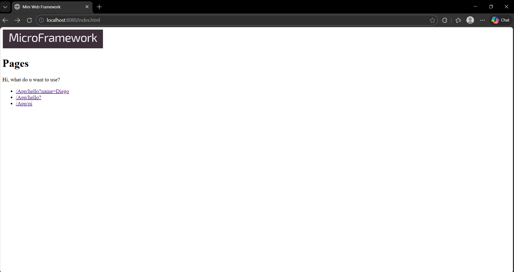

# MicroframeworksWEB (Lab 5 TDSE)

MicroframeworksWEB is a lightweight Java microframework built on top of `ServerSocket` that supports:
- Defining REST services with `get(path, (req, res) -> ...)` using lambda functions
- Extracting query parameters from the request URL via `req.getValues("param")`
- Serving static files from a configurable classpath folder using `staticfiles("webroot/")`

This project is built with Maven and demonstrates how to build a minimal web framework and understand HTTP request/response handling.

---

## Architecture

Core components:

- **MicroWeb**: Main framework class.  
  Responsibilities:
    - Starts the HTTP server (`start(port)`)
    - Registers GET routes (`get(path, handler)`)
    - Configures static file root (`staticfiles(path)`)
    - Dispatches requests to REST routes or static file handler

- **Route**: Functional interface used to define REST handlers with lambdas.

- **Request**: Represents an HTTP request and provides query param access with `getValues(key)`.

- **Response**: Represents an HTTP response configuration (status, content type).

Static files are located in:
- `src/main/resources/webroot/`
  and are loaded from the classpath at runtime (Maven copies them to `target/classes/webroot/`).

---

## Getting Started

### Prerequisites
- Java 21
- Maven 3.x

### Build
From the project root:

```bash
mvn clean package
```

### Run
Run the `Main` class (from IDE) or using the compiled classes.

The example application is in:

- `src/main/java/edu/tdse/lab5/Main.java`

It:
- configures `staticfiles("webroot/")`
- publishes REST endpoints under the `/App` prefix
- starts the server on port **8080**

---

## Usage / Manual Tests

### 1) Static files
Open in browser:

- http://localhost:8080/index.html

### 2) REST services

#### Hello with query param
- http://localhost:8080/App/hello?name=Diego

Expected output:
- `Hello Diego`

#### Pi endpoint
- http://localhost:8080/App/pi

Expected output:
- `3.1415926535...`


### Using curl (examples)
```bash
curl "http://localhost:8080/App/hello?name=Diego"
curl "http://localhost:8080/App/pi"
curl -i "http://localhost:8080/index.html"
```

--

--

---
## Authors

- Diego Alejandro Rozo Gaviria
---
## Notes
- Supported method: `GET`
- If a path is not registered as a REST route, the framework attempts to serve it as a static file from the configured `staticfiles(...)` folder.
- If neither a route nor a static file exists, the server returns **404 Not Found**.

---